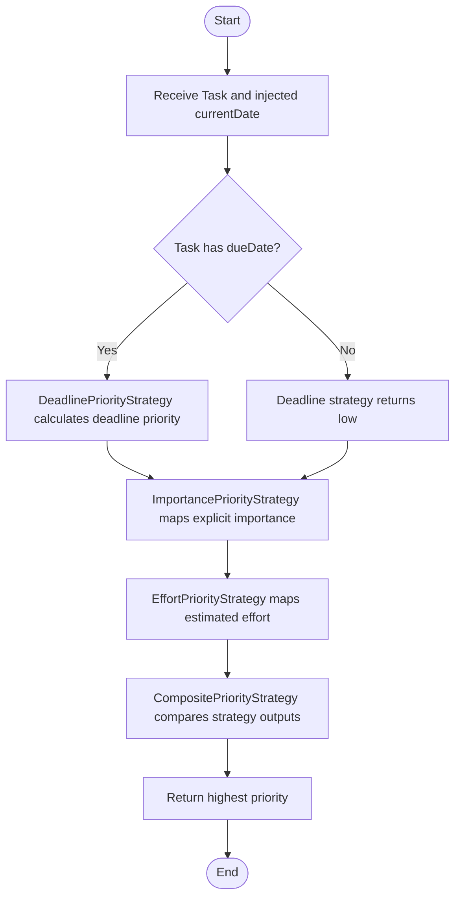

# Final Engineering Report: AI-Native Task Tracker

Software Engineering I, Part-time 2025-2026  
Project repository: `task-tracker`  
Application type: React, TypeScript, Vite, Tailwind CSS single-page application  
Primary feature: task priority calculation through the Strategy Pattern

## 1. Executive Summary

Task Tracker is a small but intentionally structured productivity application. Its immediate purpose is simple: help a user create tasks, complete tasks, view the task list, and understand which tasks deserve attention first. The deeper engineering purpose is more important for this course: the repository demonstrates how an AI-native software project can be constrained through documentation, requirements, diagrams, tests, and architectural boundaries.

The target user is an individual student, developer, or knowledge worker who needs a lightweight local-first tool for tracking work. The MVP does not attempt to compete with large project management systems. It does not include accounts, collaboration, notifications, recurring tasks, calendar integrations, or cloud synchronization. Instead, it focuses on a narrow and testable workflow: create a task, enrich it with metadata, calculate its priority, complete it, and preserve the result locally.

The central problem solved by the application is prioritization. A plain list of tasks can quickly become noisy. If every task looks the same, the user must repeatedly inspect deadlines, importance, and effort manually. Task Tracker reduces that decision cost by calculating priority from task metadata. The result is visible in the UI as low, medium, high, or urgent priority. This turns the list from a passive record into a focused planning surface.

The application is built as a Vite React frontend with TypeScript and Tailwind CSS. Tests are written with Vitest and Testing Library. Persistence is handled through a repository adapter over browser localStorage. No backend is required for the MVP, but the repository pattern keeps a future backend possible. A backend API could be introduced later by adding another `TaskRepository` implementation without changing task domain logic or React components.

The project also demonstrates the course concept of an Engineering Harness. Instead of asking an AI assistant to "make a task app" and accepting whatever code appears, the repository gives the AI agent strict instructions. `AGENTS.md` defines rules for architecture, stack, tests, documentation, and boundaries. The `/docs` folder contains requirements, Mermaid diagrams, ADRs, design contracts, deployment notes, and planning documents. The code follows those constraints: business logic stays in `src/features/tasks`, priority calculation is not placed inside React components, and pure functions avoid hidden side effects.

## 2. Project Management Foundation

The project uses a Scrumban approach, documented in `docs/pm_approach.md`. Scrumban is appropriate because the project is small and mostly implemented by one developer, but still benefits from explicit planning, continuous flow, and review checkpoints. Full Scrum would be too heavy for this scope, while pure ad hoc development would make the AI-native process less traceable.

The workflow is:

```text
Backlog -> Ready -> In Progress -> Review -> Done
```

The repository itself acts as a planning artifact. Instead of keeping the plan only in a private note, the implementation roadmap is stored in `docs/plans/roadmap.md`. This file breaks the project into stages:

1. Planning Harness.
2. AI-Ready Requirements and UML-as-Code.
3. Pattern-Based Business Logic.
4. Spec-Driven UI.
5. Deployment Readiness and Final Report.

Each stage is marked complete, and scope adjustments are documented. For example, the selected feature remained priority calculation, but task creation and completion were also implemented because the UI needs real tasks to prioritize. A backend was not added because the MVP requirements can be satisfied through localStorage behind a repository adapter. This is a deliberate scope decision, not an accidental omission.

The division of responsibility between the human developer and the AI assistant is also explicit. The human role is responsible for architecture, scope control, acceptance criteria, and final review. The AI role is useful for boilerplate, test scaffolding, implementation drafts, documentation drafting, and repetitive refactoring. This division matters because AI coding agents can produce code quickly, but they do not automatically know the course requirements, project boundaries, or long-term maintainability goals.

## 3. The Engineering Harness

The Engineering Harness is the set of constraints that makes AI-assisted development safer. The most important harness file is `AGENTS.md`. It tells AI agents that this repository is a TypeScript task tracker for a Software Engineering course project and that implementation requests must be treated as contracts defined by requirements, diagrams, tests, and architectural decisions.

Important rules from `AGENTS.md` include:

```text
- Keep UI separate from business logic.
- Keep task business logic in src/features/tasks.
- Keep pure functions free from side effects.
- Do not put priority calculation directly inside React components.
- Do not collapse strategy classes/functions into one large if/else block.
- When adding new priority behavior, add a new strategy implementation.
- Every pure function must have unit tests.
- Every priority strategy must have tests.
```

These rules are not cosmetic. They directly shaped the implementation. For example, React components do not calculate priority. They receive view models produced by `useTaskTracker`, and that hook calls `TaskPriorityService`. The service delegates to a `PriorityStrategy`. This makes it possible to test priority logic independently from the browser and independently from the UI.

The `/docs` folder provides the rest of the harness. Requirements are stored under `docs/requirements`. Architecture notes and Mermaid diagrams are stored under `docs/architecture` and `docs/diagrams`. The design decision for the Strategy Pattern is stored in `docs/decisions/adr-001-use-strategy-for-task-priority.md`. The UI contract is stored in `docs/DESIGN.md`, with a mirrored root `DESIGN.md` for quick discovery by coding assistants.

This structure prevents context loss. Instead of giving an AI agent one large document, the repository breaks context into focused files:

- `docs/requirements/feature_task_priority.md` for the selected feature.
- `docs/architecture/flow_task_priority.md` for the feature flow.
- `docs/architecture/overview.md` for the module boundaries.
- `src/features/tasks/README.md` for module-level pattern documentation.
- `docs/plans/roadmap.md` for planning and traceability.

The harness also includes tests. Tests are an executable form of requirements. The project has tests for task validation, task creation, task completion, priority ranking, each priority strategy, composite priority calculation, repository behavior, task service orchestration, and UI flows. These tests make it harder for future AI changes to silently break important behavior.

## 4. AI-Ready Requirements and Pure Functions

The selected feature for the AI-ready requirements assignment is task priority calculation. It was selected because it is small, important, and naturally benefits from a design pattern. The formal requirement is documented in `docs/requirements/feature_task_priority.md`.

The user story is:

```text
As a task tracker user,
I want the system to calculate task priority from task metadata,
so that I can focus on the most important work first.
```

The acceptance criteria use BDD-style scenarios. For example:

```text
Given an active task has a due date before the injected current date
When the system calculates priority with the deadline strategy
Then the result is urgent
```

Another scenario covers composite priority:

```text
Given one configured strategy returns medium
And another configured strategy returns urgent
When the system calculates priority with the composite strategy
Then the result is urgent
```

These scenarios are intentionally specific. A vague requirement such as "show important tasks first" would allow too many interpretations. The AI assistant might rank by creation date, alphabetically sort tasks, or place a large conditional inside a React component. The BDD requirements remove that ambiguity.

The pure-function constraint is also explicit. Priority logic must not read system time directly. Instead, the current date is injected by the caller. This is visible in the interface:

```ts
export interface PriorityStrategy {
  calculate(task: Task, currentDate: Date): TaskPriority;
}
```

This signature forces the strategy to receive time as an input. The strategy does not call `new Date()` internally. That makes the function deterministic and testable. The same task and same injected date always produce the same result.

The task domain also contains pure functions:

- `validateTaskInput(input)`
- `createTask(input, id, createdAt)`
- `completeTask(task, completedAt)`
- `getHighestPriority(priorities)`

These functions do not access React, DOM, network, or browser storage. ID generation and current time are injected by `TaskService`, which means tests can control them exactly.

## 5. UML-as-Code and Architecture-as-Code

The project uses Mermaid diagrams as text-based architecture documentation. This is important in AI-native development because diagrams stored as text are readable by both humans and AI agents. They can be reviewed in Git diffs, rendered by GitHub, and used as context in prompts.

The feature flow is documented in `docs/architecture/flow_task_priority.md`:



The class structure is documented in `docs/diagrams/priority-strategy-class-diagram.md`. It shows the relationship between `TaskPriorityService`, `PriorityStrategy`, concrete strategies, `TaskService`, `TaskRepository`, and the UI hook. The diagram makes the dependency direction visible: UI calls services, services call domain and repository boundaries, and strategies stay independent of UI and storage.

The architecture overview in `docs/architecture/overview.md` defines the main layers:

- Composition Root.
- UI Layer.
- Service Layer.
- Domain Layer.
- Strategy Layer.
- Repository Layer.

The dependency direction is:

```text
UI -> Services -> Domain / Strategies / Repositories
Composition Root -> Concrete Repositories / Strategies / Services
```

This structure keeps the application small but not chaotic. It is intentionally not a large enterprise architecture. The goal is enough structure to prevent spaghetti code, not enough abstraction to slow down development.

## 6. Design Pattern: Strategy Pattern

The selected design pattern is the Strategy Pattern. The decision is documented in `docs/decisions/adr-001-use-strategy-for-task-priority.md` and in `src/features/tasks/README.md`.

The Strategy Pattern is appropriate because task priority can be calculated by different algorithms:

- Deadline proximity.
- Explicit importance.
- Estimated effort.
- A composite result across several signals.

If all of these rules were placed in one function, the code would likely become a long conditional block. That is especially risky with AI-assisted development. When asked to add new priority behavior, an AI agent might insert another branch into an already complicated function. Over time, this would make the feature harder to test and harder to reason about.

The implemented participants are:

| Participant | Responsibility |
|---|---|
| `PriorityStrategy` | Common interface |
| `DeadlinePriorityStrategy` | Calculates priority from due date |
| `ImportancePriorityStrategy` | Maps explicit importance |
| `EffortPriorityStrategy` | Maps estimated effort |
| `CompositePriorityStrategy` | Returns the highest result from configured strategies |
| `TaskPriorityService` | Context/orchestrator |

The deadline strategy follows these rules:

- overdue task -> `urgent`
- due within 24 hours -> `high`
- due within 7 days -> `medium`
- no due date or later than 7 days -> `low`

The importance strategy maps:

- `high` -> `high`
- `medium` -> `medium`
- `low` -> `low`

The effort strategy maps:

- more than 8 hours -> `high`
- 3 to 8 hours -> `medium`
- below 3 hours or missing effort -> `low`

The composite strategy calls each configured strategy and returns the highest priority using `getHighestPriority`. This keeps comparison logic in one small domain helper instead of duplicating rank comparisons throughout the application.

The pattern clarified the code. It did add more files than a single function would have required, but each file has a clear responsibility. For this course project, that trade-off is acceptable because the purpose is not only to build a working feature, but also to demonstrate structural integrity.

## 7. Repository and Service Boundaries

Task Tracker uses repository and service boundaries to keep business logic independent from storage and UI details.

The repository interface is:

```ts
export interface TaskRepository {
  list(): Promise<Task[]>;
  findById(id: string): Promise<Task | undefined>;
  save(task: Task): Promise<Task>;
  replaceAll(tasks: Task[]): Promise<void>;
}
```

There are two implementations:

- `InMemoryTaskRepository` for tests and fallback.
- `LocalStorageTaskRepository` for the browser app.

The UI does not access localStorage directly. The composition root in `src/app/create-task-services.ts` creates the browser repository and injects it into `TaskService`. This design means persistence can be changed later. For example, a future backend version could add `HttpTaskRepository` without changing domain functions or React components.

`TaskService` orchestrates use cases:

- list tasks,
- create a task,
- complete a task.

It validates input with `validateTaskInput`, creates task entities with `createTask`, completes tasks with `completeTask`, and saves results through `TaskRepository`. ID generation and current timestamps are injected into the service. This keeps deterministic logic testable and makes side effects explicit.

This boundary is one of the most important maintainability decisions in the project. It prevents the UI from becoming a place where validation, timestamp generation, localStorage access, and priority calculation are mixed together.

## 8. Spec-Driven UI and Frontend Orchestration

The UI assignment required a strict design contract. The canonical design contract is stored in `docs/DESIGN.md`. A mirrored root `DESIGN.md` also exists so AI coding assistants can quickly find the UI rules.

The design contract defines:

- Framework choice: React + Tailwind + Vite.
- Color palette with exact hex values.
- Typography and spacing rules.
- Component rules for buttons, forms, task cards, and filters.
- Integration rules requiring UI to call services instead of duplicating business logic.
- Accessibility rules requiring labels and text-visible status.

The resulting interface is a working application screen, not a landing page. On desktop it uses two columns. The left column contains the app identity and task creation form. The right column contains summary metrics, filters, and the task list. On mobile the layout stacks vertically.

The main UI components are:

- `TaskForm`
- `TaskSummary`
- `TaskFilters`
- `TaskList`
- `useTaskTracker`

The `TaskForm` collects title, description, due date, importance, and effort. It does not implement the business validation rules directly. Instead, it submits data to the task service through the hook and displays errors returned by the service.

The `TaskList` displays each task with title, optional description, priority, status, due date, importance, and estimated effort. Active tasks have a `Complete` button. Completed tasks do not show that action. This is a direct UI reflection of the completion rule.

The `useTaskTracker` hook coordinates UI state. It loads tasks, creates tasks, completes tasks, applies the selected filter, and maps domain tasks to view models with calculated priority. The hook calls `TaskPriorityService`, so priority logic remains outside React components.

### Screenshot References

The final PDF should include screenshots after deployment. The following screenshots should be captured from the deployed web app:

1. Initial empty task tracker screen with the create form, summary metrics, filters, and empty list message.
2. Task list after creating at least three tasks with different due dates, importance values, and effort estimates.
3. Completed task state showing that the completed task no longer exposes the `Complete` action.

These screenshots correspond to the implemented UI flows covered by `src/App.test.tsx`.

## 9. Testing and Verification

The application is covered by unit and UI tests. The test suite verifies the most important business and integration behavior.

Current coverage areas:

- Task input validation.
- Task entity creation.
- Task completion.
- Priority ranking.
- Deadline priority strategy.
- Importance priority strategy.
- Effort priority strategy.
- Composite priority strategy.
- Task priority service.
- In-memory repository.
- Task service use cases.
- UI create and complete flows.

The final verification commands are:

```bash
npm test -- --run
npm run build
```

The test suite passes with 12 test files and 37 tests. The production build also passes. The build output is generated under `dist`, which is the directory used by Vercel or Netlify.

Testing was especially valuable during development. Runtime tests initially passed, but TypeScript build exposed stricter issues: concrete strategies did not exactly match the interface signature, and the Vite/Vitest configuration needed dependency alignment. Fixing those build issues improved the integrity of the codebase.

## 10. Deployment Configuration

The application is deployment-ready as a static frontend. The recommended platform is Vercel because it integrates directly with GitHub and supports Vite projects with minimal configuration.

The repository includes `vercel.json`:

```json
{
  "buildCommand": "npm run build",
  "outputDirectory": "dist",
  "framework": "vite",
  "rewrites": [
    {
      "source": "/(.*)",
      "destination": "/index.html"
    }
  ]
}
```

The deployment steps are documented in `docs/deployment.md`:

1. Push the repository to GitHub.
2. Import the repository into Vercel.
3. Keep Vite as the framework.
4. Use `npm run build` as the build command.
5. Use `dist` as the output directory.
6. Deploy from the `main` branch.

No environment variables are required. No secrets are required. No backend service is required. The app stores tasks in the user's browser localStorage.

For Moodle submission, the deployed app URL should be filled in after connecting the GitHub repository to Vercel or Netlify. The repository is already prepared for that step.

## 11. PKM Insights and Retrospective

The course assignments asked students to reflect on AI-assisted development through PKM experiment logs. This product repository contains the product-side artifacts, while PKM logs are expected to live in a separate personal knowledge management repository.

The main insight from this project is that AI works best when the problem is constrained. If the prompt is only "build a task tracker", the assistant may produce an attractive but unstructured interface, mix localStorage into components, calculate priority inside React, skip tests, or invent features outside the assignment. When the prompt includes BDD requirements, Mermaid diagrams, `AGENTS.md`, pure-function rules, and an ADR, the output becomes more predictable.

The second insight is that overengineering is a real risk. The Strategy Pattern is useful for priority calculation because there are multiple interchangeable algorithms. However, not every part of the app needs a pattern. A small task form does not need a factory hierarchy. A localStorage adapter does not require a complex infrastructure layer. Good engineering means using structure where it reduces risk and avoiding structure where it only adds ceremony.

The third insight is that tests are the strongest practical harness. Documentation tells the AI what should happen, but tests verify what actually happens. The project uses tests not only for pure functions but also for services, repositories, strategies, and UI flows. This helped catch issues that could have remained hidden in manual testing.

The fourth insight is that build tooling is part of engineering quality. The app initially had a dependency mismatch between Vite and Vitest. The tests could run, but TypeScript build failed. Fixing the toolchain was necessary because a deployed application must pass production build, not only local runtime tests.

The future role of a software engineer in this workflow is closer to system architect, reviewer, and constraint designer. The engineer defines boundaries, writes acceptance criteria, chooses patterns, reviews outputs, and decides scope. AI can accelerate implementation, but it should not be allowed to silently choose architecture or redefine requirements.

## 12. Requirements Traceability Matrix

| Assignment | Requirement | Repository Evidence |
|---|---|---|
| Practical Assignment 2 | `AGENTS.md` instructions | `AGENTS.md` |
| Practical Assignment 2 | project management approach | `docs/pm_approach.md` |
| Practical Assignment 2 | roadmap | `docs/plans/roadmap.md` |
| Practical Assignment 3 | BDD requirements | `docs/requirements/feature_task_priority.md` |
| Practical Assignment 3 | Mermaid feature flow | `docs/architecture/flow_task_priority.md` |
| Practical Assignment 3 | pure-function constraint | `docs/requirements/feature_task_priority.md`, `src/features/tasks/domain/` |
| Practical Assignment 4 | dedicated module | `src/features/tasks/` |
| Practical Assignment 4 | pattern implementation | `src/features/tasks/strategies/` |
| Practical Assignment 4 | module README | `src/features/tasks/README.md` |
| Practical Assignment 4 | diagram update | `docs/diagrams/priority-strategy-class-diagram.md` |
| Practical Assignment 5 | design contract | `docs/DESIGN.md` |
| Practical Assignment 5 | generated frontend connected to logic | `src/features/tasks/ui/`, `src/App.tsx` |
| Practical Assignment 6 | deployment config | `vercel.json`, `docs/deployment.md` |
| Practical Assignment 6 | final report | `FINAL_REPORT.md` |

## 13. Final Submission Checklist

For Moodle submission, provide:

1. Deployed Web App URL: fill after Vercel or Netlify deployment.
2. Final Product Repo URL: GitHub repository URL.
3. PKM Repo URL: optional, if the PKM experiment logs are available.
4. Final Report: export this `FINAL_REPORT.md` to PDF and upload it.

## 14. Conclusion

Task Tracker is intentionally small, but it demonstrates the full software engineering lifecycle required by the course. It starts with planning and AI instructions, continues through BDD requirements and Mermaid diagrams, implements a pattern-based business module, connects that module to a spec-driven UI, prepares deployment configuration, and ends with a final engineering report.

The most important result is not only that the app works. The important result is that the repository explains why the app is structured the way it is. Future AI agents can read `AGENTS.md`, follow the docs, run the tests, and extend the system without guessing. That is the purpose of the Engineering Harness: make the desired architecture explicit enough that both humans and machines can preserve it.
