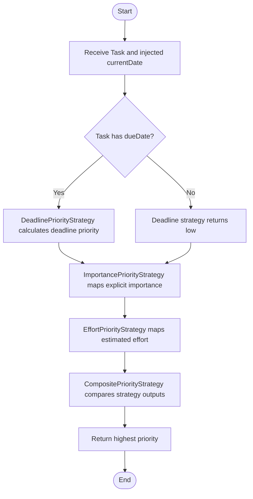

# Flow: Task Priority Calculation

This Mermaid flowchart documents the selected MVP feature from `docs/requirements/feature_task_priority.md`.

## Architectural Notes

- `currentDate` is injected by the caller.
- Deadline, importance, and effort algorithms are separate strategies.
- The composite strategy combines strategy outputs and returns the highest priority.
- React components do not implement or duplicate the priority rules.
