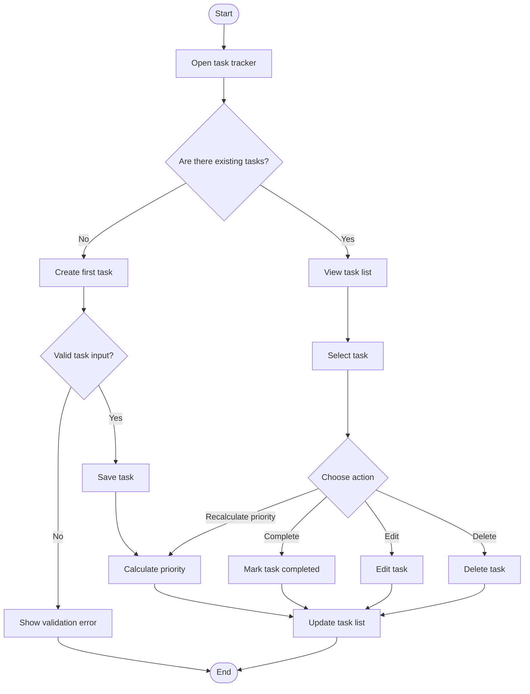

# Activity Flow

```mermaid
flowchart TD
    Start([Start]) --> OpenApp[Open task tracker]
    OpenApp --> HasTasks{Are there existing tasks?}
    HasTasks -- No --> CreateFirst[Create first task]
    HasTasks -- Yes --> ViewList[View task list]

    CreateFirst --> Validate{Valid task input?}
    Validate -- No --> ShowError[Show validation error]
    Validate -- Yes --> SaveTask[Save task]

    SaveTask --> CalculatePriority[Calculate priority]
    ViewList --> SelectTask[Select task]
    SelectTask --> Action{Choose action}

    Action -- Complete --> CompleteTask[Mark task completed]
    Action -- Edit --> EditTask[Edit task]
    Action -- Delete --> DeleteTask[Delete task]
    Action -- Recalculate priority --> CalculatePriority

    CalculatePriority --> UpdateList[Update task list]
    CompleteTask --> UpdateList
    EditTask --> UpdateList
    DeleteTask --> UpdateList
    ShowError --> End([End])
    UpdateList --> End
```
