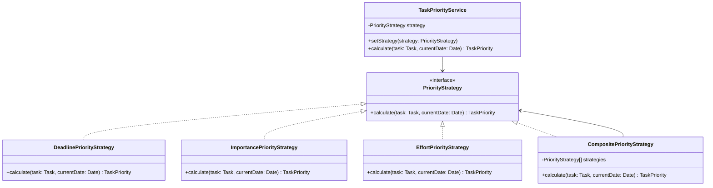

# Priority Strategy Class Diagram

```mermaid
classDiagram
    class TaskPriorityService {
      -PriorityStrategy strategy
      +setStrategy(strategy: PriorityStrategy)
      +calculate(task: Task, currentDate: Date) TaskPriority
    }

    class PriorityStrategy {
      <<interface>>
      +calculate(task: Task, currentDate: Date) TaskPriority
    }

    class DeadlinePriorityStrategy {
      +calculate(task: Task, currentDate: Date) TaskPriority
    }

    class ImportancePriorityStrategy {
      +calculate(task: Task, currentDate: Date) TaskPriority
    }

    class EffortPriorityStrategy {
      +calculate(task: Task, currentDate: Date) TaskPriority
    }

    class CompositePriorityStrategy {
      -PriorityStrategy[] strategies
      +calculate(task: Task, currentDate: Date) TaskPriority
    }

    TaskPriorityService --> PriorityStrategy
    PriorityStrategy <|.. DeadlinePriorityStrategy
    PriorityStrategy <|.. ImportancePriorityStrategy
    PriorityStrategy <|.. EffortPriorityStrategy
    PriorityStrategy <|.. CompositePriorityStrategy
    CompositePriorityStrategy --> PriorityStrategy
```
