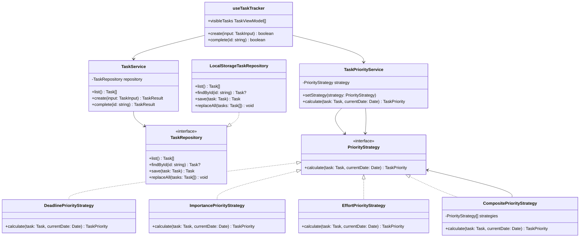

# Priority Strategy Class Diagram

```mermaid
classDiagram
    class TaskPriorityService {
      -PriorityStrategy strategy
      +setStrategy(strategy: PriorityStrategy)
      +calculate(task: Task, currentDate: Date) TaskPriority
    }

    class TaskService {
      -TaskRepository repository
      +list() Task[]
      +create(input: TaskInput) TaskResult
      +complete(id: string) TaskResult
    }

    class TaskRepository {
      <<interface>>
      +list() Task[]
      +findById(id: string) Task?
      +save(task: Task) Task
      +replaceAll(tasks: Task[]) void
    }

    class LocalStorageTaskRepository {
      +list() Task[]
      +findById(id: string) Task?
      +save(task: Task) Task
      +replaceAll(tasks: Task[]) void
    }

    class useTaskTracker {
      +create(input: TaskInput) boolean
      +complete(id: string) boolean
      +visibleTasks TaskViewModel[]
    }

    class PriorityStrategy {
      <<interface>>
      +calculate(task: Task, currentDate: Date) TaskPriority
    }

    class DeadlinePriorityStrategy {
      +calculate(task: Task, currentDate: Date) TaskPriority
    }

    class ImportancePriorityStrategy {
      +calculate(task: Task, currentDate: Date) TaskPriority
    }

    class EffortPriorityStrategy {
      +calculate(task: Task, currentDate: Date) TaskPriority
    }

    class CompositePriorityStrategy {
      -PriorityStrategy[] strategies
      +calculate(task: Task, currentDate: Date) TaskPriority
    }

    TaskPriorityService --> PriorityStrategy
    PriorityStrategy <|.. DeadlinePriorityStrategy
    PriorityStrategy <|.. ImportancePriorityStrategy
    PriorityStrategy <|.. EffortPriorityStrategy
    PriorityStrategy <|.. CompositePriorityStrategy
    CompositePriorityStrategy --> PriorityStrategy
    TaskPriorityService --> PriorityStrategy
    TaskService --> TaskRepository
    LocalStorageTaskRepository ..|> TaskRepository
    useTaskTracker --> TaskService
    useTaskTracker --> TaskPriorityService
```
