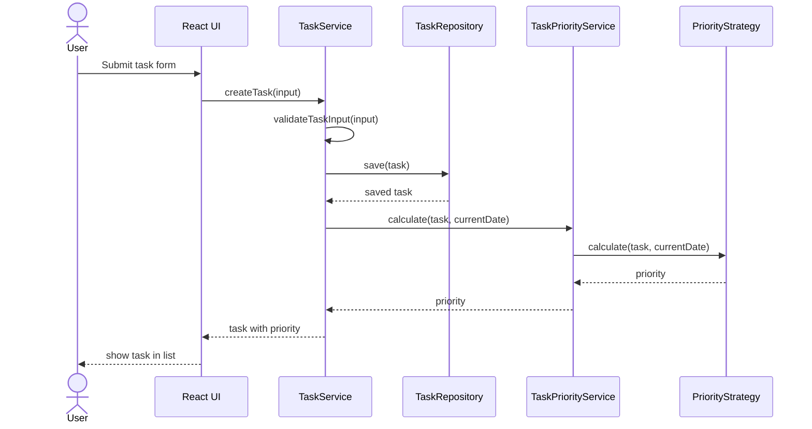

# Sequence Flow: Create and Prioritize Task

```mermaid
sequenceDiagram
    actor User
    participant UI as React UI
    participant TaskService
    participant Repository as TaskRepository
    participant PriorityService as TaskPriorityService
    participant Strategy as PriorityStrategy

    User->>UI: Submit task form
    UI->>TaskService: createTask(input)
    TaskService->>TaskService: validateTaskInput(input)
    TaskService->>Repository: save(task)
    Repository-->>TaskService: saved task
    TaskService->>PriorityService: calculate(task, currentDate)
    PriorityService->>Strategy: calculate(task, currentDate)
    Strategy-->>PriorityService: priority
    PriorityService-->>TaskService: priority
    TaskService-->>UI: task with priority
    UI-->>User: show task in list
```
