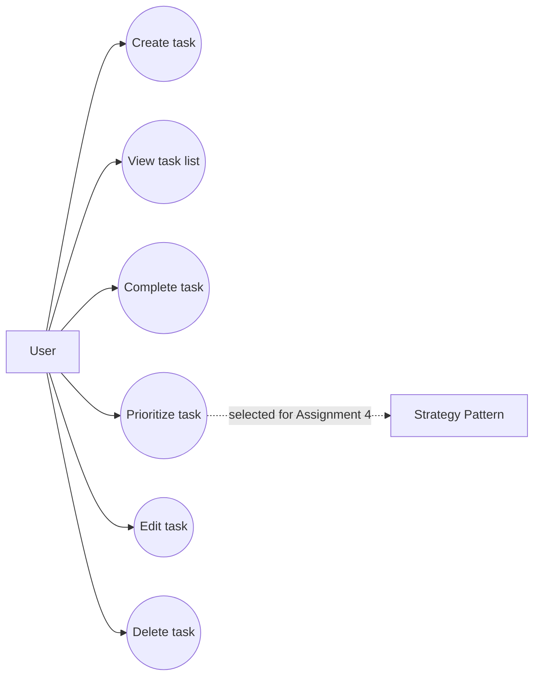

# Use Case Diagram

```mermaid
flowchart LR
    User[User]

    User --> CreateTask((Create task))
    User --> ViewTasks((View task list))
    User --> CompleteTask((Complete task))
    User --> PrioritizeTask((Prioritize task))
    User --> EditTask((Edit task))
    User --> DeleteTask((Delete task))

    PrioritizeTask -. selected for Assignment 4 .-> StrategyPattern[Strategy Pattern]
```
