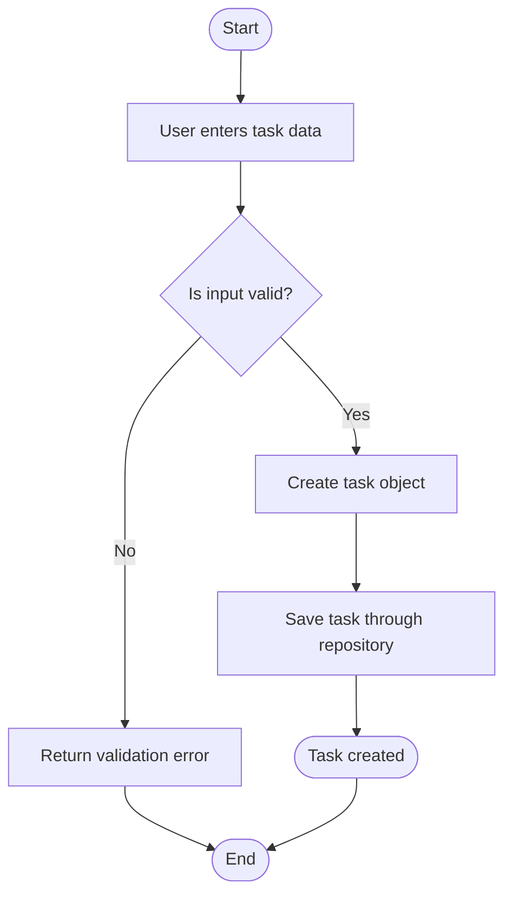

# STORY-001: Create Task

## User Story

```text
As a user,
I want to create a task with a title, optional description, due date, importance, and estimated effort,
so that I can record work that I need to complete.
```

## Context

This story defines the minimum task creation behavior.

Related files:

- `src/features/tasks/domain/task.ts`
- `src/features/tasks/services/task-service.ts`
- `src/features/tasks/repositories/task-repository.ts`

## Constraints

- The task title is required.
- The title must not be empty after trimming whitespace.
- Description is optional.
- Due date is optional.
- Importance must be one of: `low`, `medium`, `high`.
- Estimated effort must be a non-negative number if provided.
- Task creation logic must not depend on React components.
- Task creation validation should be implemented as pure functions where possible.

## Acceptance Criteria

```gherkin
Feature: Create task

  Scenario: Create a valid task with required title
    Given I provide a title "Write project documentation"
    When I create a task
    Then the task is created with status "active"
    And the task has a generated id
    And the task has a createdAt timestamp

  Scenario: Reject an empty task title
    Given I provide a title containing only whitespace
    When I try to create a task
    Then the task is not created
    And I receive a validation error "Task title is required"

  Scenario: Create a task with optional metadata
    Given I provide a title, description, due date, importance, and estimated effort
    When I create a task
    Then the task stores all provided metadata
```

## Pure Function Contract

### `validateTaskInput(input)`

Input:

```ts
{
  title: string;
  description?: string;
  dueDate?: string;
  importance?: "low" | "medium" | "high";
  estimatedEffortHours?: number;
}
```

Output:

```ts
{
  valid: boolean;
  errors: string[];
}
```

Rules:

- The same input must always return the same output.
- The function must not write to storage.
- The function must not generate ids.
- The function must not read current time.

## Mermaid Activity Diagram



## Testing Notes

- Test valid title.
- Test empty title.
- Test whitespace-only title.
- Test optional fields.
- Test invalid estimated effort.
