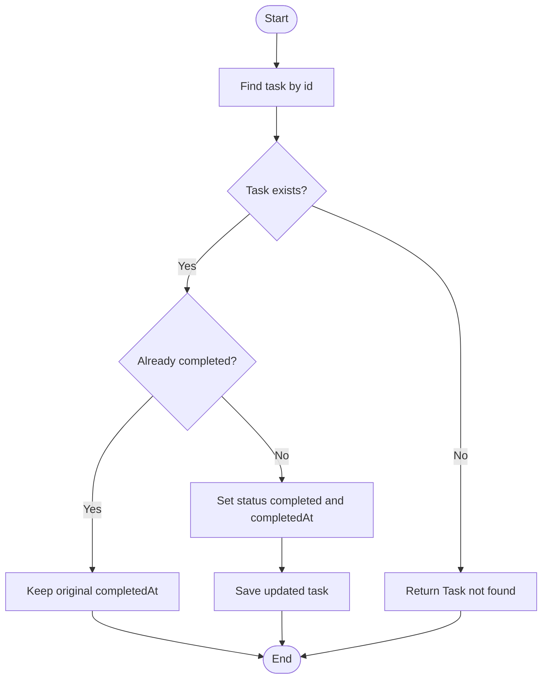

# STORY-002: Complete Task

## User Story

```text
As a user,
I want to mark an active task as completed,
so that I can track finished work.
```

## Context

This story defines task completion behavior.

Related files:

- `src/features/tasks/domain/task.ts`
- `src/features/tasks/services/task-service.ts`

## Constraints

- Only active tasks can be completed.
- Completing a task sets status to `completed`.
- Completing a task sets `completedAt`.
- Completing an already completed task must not overwrite the original `completedAt`.
- Completion logic should be testable without UI.

## Acceptance Criteria

```gherkin
Feature: Complete task

  Scenario: Complete an active task
    Given an active task exists
    When I mark the task as completed
    Then the task status becomes "completed"
    And the task receives a completedAt timestamp

  Scenario: Do not overwrite completion timestamp
    Given a task is already completed
    When I try to complete it again
    Then the original completedAt timestamp remains unchanged

  Scenario: Reject missing task
    Given no task exists with the requested id
    When I try to complete the task
    Then I receive an error "Task not found"
```

## Pure Function Contract

### `completeTask(task, completedAt)`

Input:

```ts
task: Task
completedAt: string
```

Output:

```ts
Task
```

Rules:

- If task is active, return a new completed task.
- If task is already completed, return the task unchanged.
- Do not mutate the original task.
- Do not read current time inside the function.
- Current time must be injected as an argument.

## Mermaid Activity Diagram



## Testing Notes

- Complete active task.
- Re-complete completed task.
- Ensure original object is not mutated.
- Missing task error.
