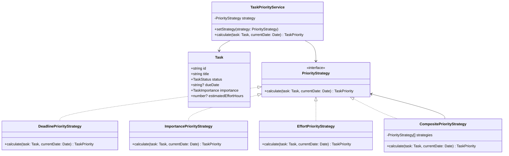

# STORY-003: Prioritize Task

## User Story

```text
As a user,
I want the system to calculate task priority from task metadata,
so that I can focus on the most important tasks first.
```

## Context

This is the selected feature for Practical Assignment 4.

The feature must be implemented through the **Strategy Pattern**.

Related files:

- `src/features/tasks/domain/task.ts`
- `src/features/tasks/strategies/priority-strategy.ts`
- `src/features/tasks/strategies/deadline-priority-strategy.ts`
- `src/features/tasks/strategies/importance-priority-strategy.ts`
- `src/features/tasks/strategies/effort-priority-strategy.ts`
- `src/features/tasks/services/task-priority-service.ts`

## Constraints

- Priority logic must not be implemented in React components.
- Priority logic must not be one large `if/else` or `switch` block.
- Each priority algorithm must be encapsulated in a separate strategy.
- Each strategy must implement the same interface.
- Strategies must be testable independently.
- Current date must be injected into strategies that need time-based logic.
- No strategy may directly access localStorage, DOM, or network.

## Priority Levels

```ts
type TaskPriority = "low" | "medium" | "high" | "urgent";
```

## Strategy Candidates

### DeadlinePriorityStrategy

Calculates priority from due date.

Rules:

- overdue task → `urgent`,
- due within 24 hours → `high`,
- due within 7 days → `medium`,
- no due date or later than 7 days → `low`.

### ImportancePriorityStrategy

Calculates priority from explicit importance.

Rules:

- importance `high` → `high`,
- importance `medium` → `medium`,
- importance `low` → `low`.

### EffortPriorityStrategy

Calculates priority from estimated effort.

Rules:

- effort greater than 8 hours → `high`,
- effort between 3 and 8 hours → `medium`,
- effort below 3 hours → `low`.

### CompositePriorityStrategy

Combines multiple strategies and returns the highest resulting priority.

## Acceptance Criteria

```gherkin
Feature: Prioritize task

  Scenario: Overdue task becomes urgent
    Given a task has a due date before the current date
    When priority is calculated using DeadlinePriorityStrategy
    Then the result is "urgent"

  Scenario: Task due within 24 hours becomes high priority
    Given a task is due within the next 24 hours
    When priority is calculated using DeadlinePriorityStrategy
    Then the result is "high"

  Scenario: Explicit high importance becomes high priority
    Given a task has importance "high"
    When priority is calculated using ImportancePriorityStrategy
    Then the result is "high"

  Scenario: Composite strategy returns highest priority
    Given one strategy returns "medium"
    And another strategy returns "urgent"
    When priority is calculated using CompositePriorityStrategy
    Then the result is "urgent"
```

## Pure Function Contract

### `calculateDeadlinePriority(task, currentDate)`

Input:

```ts
task: Task
currentDate: Date
```

Output:

```ts
TaskPriority
```

Rules:

- The function must not mutate the task.
- The function must not read current time internally.
- The same task and currentDate must always return the same priority.
- The function must not access storage, UI, or network.

## Mermaid Class Diagram



## Testing Notes

- Test each strategy separately.
- Test composite strategy.
- Test missing due date.
- Test overdue due date.
- Test exact 24-hour boundary.
- Test no side effects.
